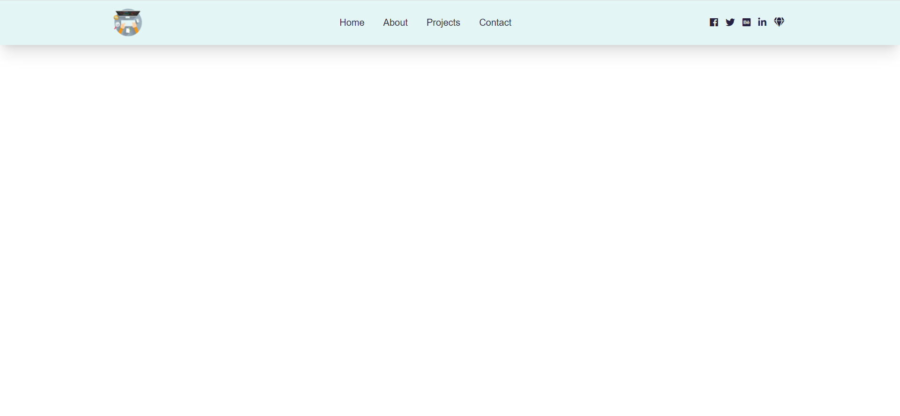

# Responsove Navbar

To start project

1. Download or clone git repository
2. Install any Live Server
3. Right button click to launch live server

---

Completed project [here](https://malinsp.github.io/navbar.github.io/)

---
#### Screenshots

